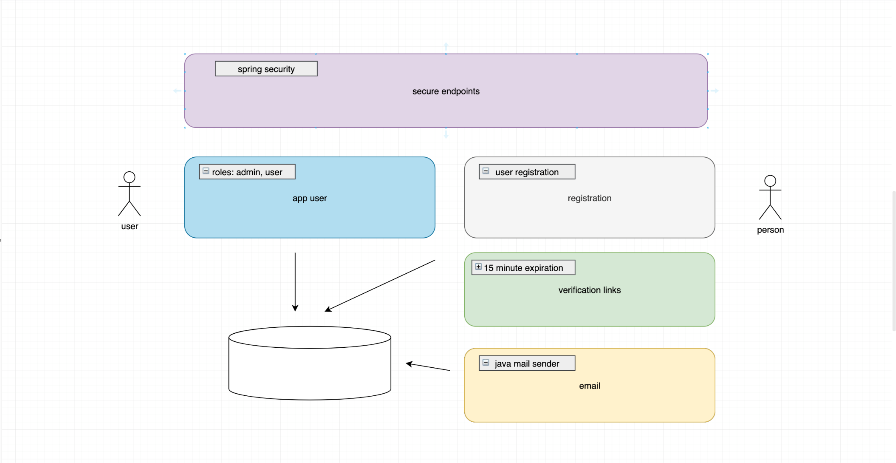
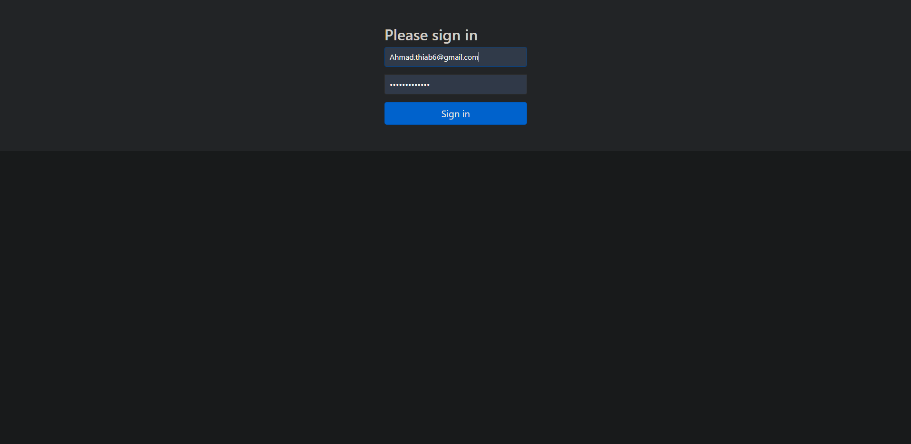
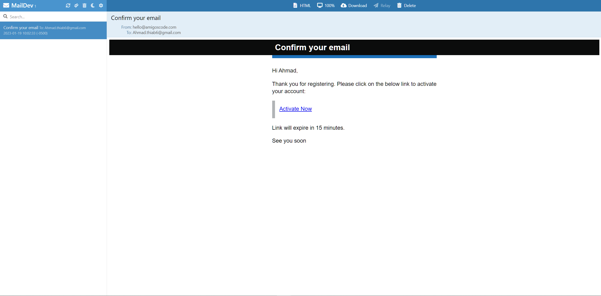
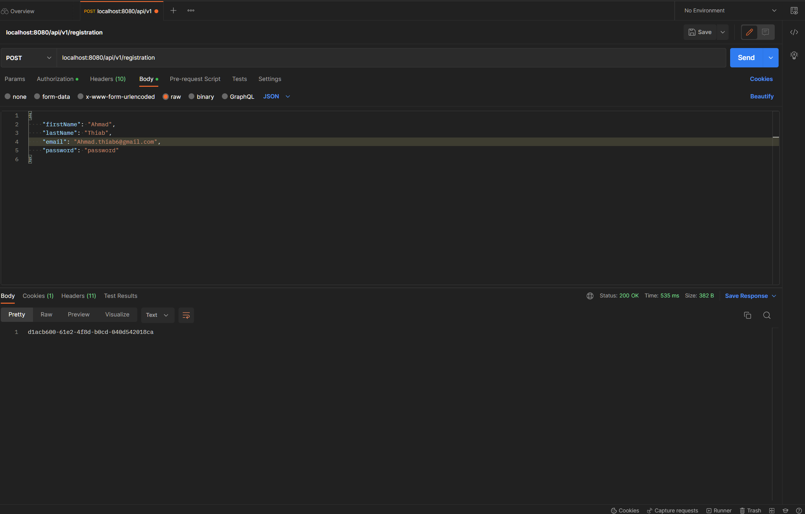

# Summary
Designed and deployed a backend application for user login and registration with email verification and a Postgres database. The app is separated into 5 different components.
The app user with different roles (admin, user), the registration service, Spring Security for authentication and authorization, verification link with expiration and the Spring JavaMailSender API for sending emails.

# Quick Start
- Database setup
<pre>
# Download and install a PostgreSQL server

# Open the psql command-line tool
  psql -U USER_NAME

# Run a CREATE DATABASE command and name it "registration" 
  create database registration;
</pre>
- Setup local email (SMTP) server
<pre>
# maildev
  https://github.com/maildev/maildev
</pre>

## Diagram

## Login page

## Email verification link with expiry

## Postman

# CURL
<pre>
curl --location --request POST 'localhost:8080/api/v1/registration' \
--header 'Content-Type: application/json' \
--data-raw '{
    "firstName": "Ahmad",
    "lastName": "Thiab",
    "email": "Ahmad.thiab6@gmail.com",
    "password": "password"
}'
</pre>
